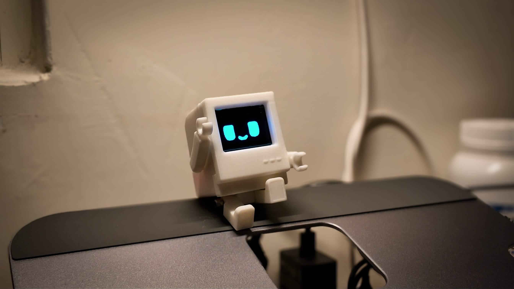

# QBIT
An open-source ESP32-C3 desktop companion robot and personal IoT avatar.

## License

This project is licensed under the [Creative Commons Attribution-NonCommercial-ShareAlike 4.0 International (CC BY-NC-SA 4.0)](https://creativecommons.org/licenses/by-nc-sa/4.0/).

Commercial use of this project or any derivative works is not permitted without explicit permission from the author. For commercial licensing, contact: scx@gapp.nthu.edu.tw
