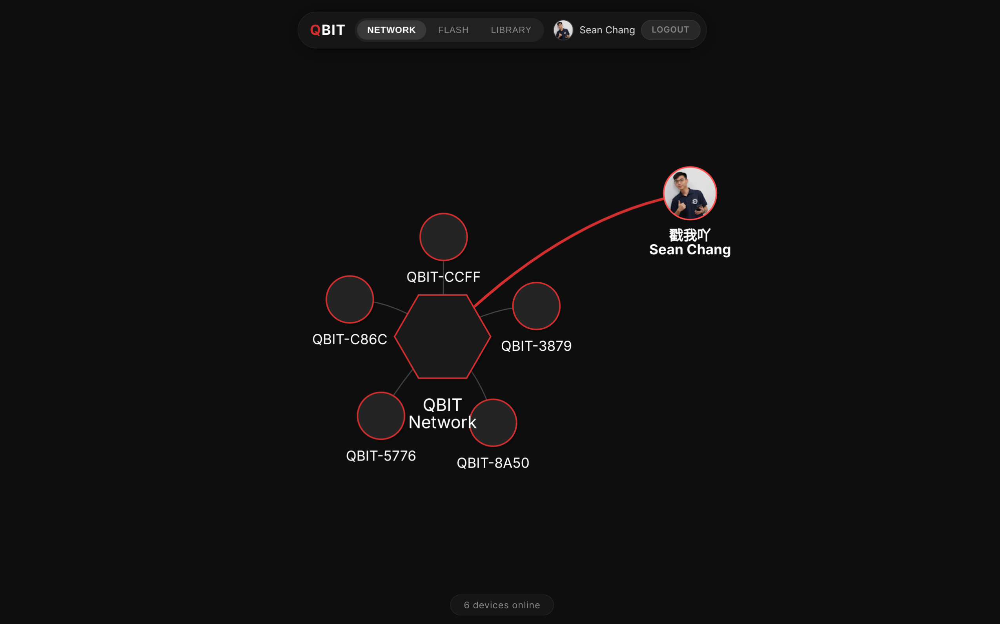
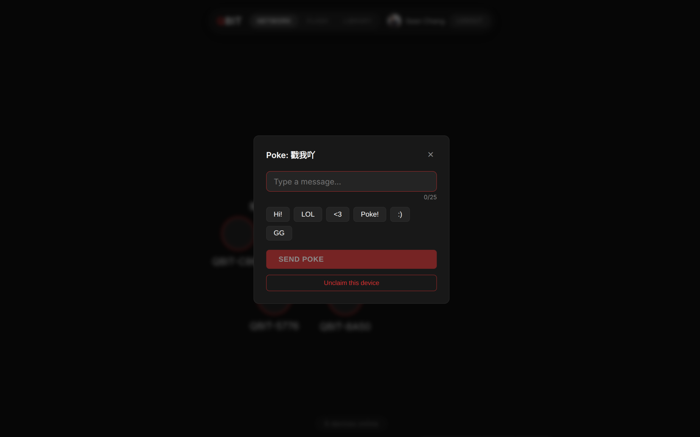
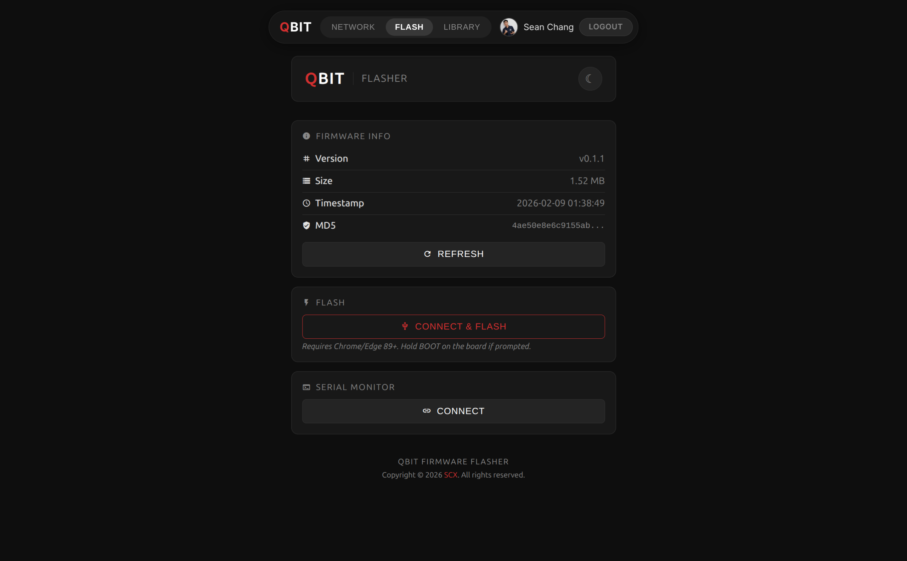
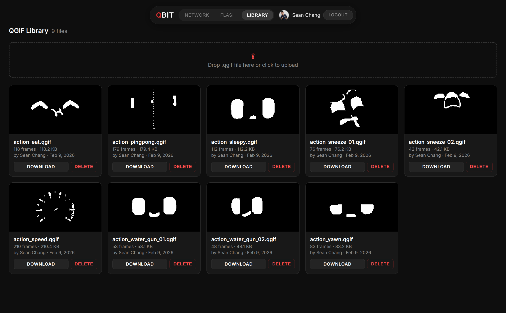

<p align="right"><a href="README.md">English</a></p>

<div align="center">

# QBIT

**一款開源的 ESP32-C3 桌面陪伴機器人與個人 IoT 虛擬化身。**

[](https://creativecommons.org/licenses/by-nc-sa/4.0/)
[](#硬體需求)
[](https://qbit.labxcloud.com)

<br>

[](https://youtu.be/pUKB8I10Yfk)

*點擊上方圖片觀看 YouTube 組裝影片。*

</div>

<br>

<table>
<tr>
<td width="50%" align="center">

<br><strong>網路</strong><br>即時裝置拓撲圖
</td>
<td width="50%" align="center">

<br><strong>戳一下</strong><br>向裝置傳送訊息
</td>
</tr>
<tr>
<td width="50%" align="center">

<br><strong>燒錄</strong><br>瀏覽器版韌體燒錄器
</td>
<td width="50%" align="center">

<br><strong>素材庫</strong><br>社群動畫資源庫
</td>
</tr>
</table>

<br>

<div align="center">

[**快速開始**](#快速開始) &#8226;
[**硬體需求**](#硬體需求) &#8226;
[**網頁平台**](#網頁平台) &#8226;
[**MQTT**](#mqtt-與-home-assistant) &#8226;
[**自架平台**](#自架網頁平台) &#8226;
[**從原始碼編譯**](#從原始碼編譯韌體)

</div>

---

## 硬體需求

### 元件清單

| 元件 | 規格 | 備註 |
|---|---|---|
| MCU | ESP32-C3 Super Mini（例如 Seeed XIAO ESP32-C3） | 可用 GPIO：0-10、20、21 |
| OLED 顯示器 | SSD1306 128x64，I2C，位址 0x3C | 亦支援 SH1106 相容模組 |
| 觸控感測器 | TTP223 電容式觸控模組 | 數位輸出（觸碰時 HIGH） |
| 蜂鳴器 | 無源蜂鳴器 | 透過 PWM (LEDC) 驅動 |

### 接線方式

以下為 ESP32-C3 Super Mini 的預設腳位配置。所有腳位皆可透過 `http://qbit.local` 網頁儀表板重新設定，設定值儲存於 NVS（重新開機後仍保留；更改腳位後需重新啟動才會生效）。

| 功能 | 預設 GPIO | 方向 | 接線 |
|---|---|---|---|
| 觸控感測器 (TTP223) | GPIO 1 | 輸入 | TTP223 OUT -> GPIO 1 |
| 蜂鳴器 | GPIO 2 | 輸出 | GPIO 2 -> 蜂鳴器 +，蜂鳴器 - -> GND |
| OLED SDA | GPIO 20 | I2C 資料 | SSD1306 SDA -> GPIO 20 |
| OLED SCL | GPIO 21 | I2C 時脈 | SSD1306 SCL -> GPIO 21 |

電源接線：

| 元件 | VCC | GND |
|---|---|---|
| SSD1306 OLED | 3.3V | GND |
| TTP223 觸控感測器 | 3.3V | GND |
| 無源蜂鳴器 | -- | GND |

I2C 匯流排運行於 400 kHz。若 OLED 模組已內建上拉電阻（大多數開發板模組皆有），則無需外接上拉電阻。

---

## 快速開始

### 燒錄韌體

最簡單的韌體燒錄方式是使用瀏覽器版燒錄工具，無需安裝任何工具鏈。

1. 使用 Chrome 或 Edge（89 版以上）開啟 [QBIT 韌體燒錄器](https://seanchangx.github.io/QBIT/)。
2. 透過 USB 連接 QBIT 開發板。
3. 點擊 **Connect & Flash**，選擇對應的序列埠。
4. 燒錄器會自動寫入 bootloader、分割表、韌體及檔案系統映像。

### 初始 Wi-Fi 設定

燒錄完成後，QBIT 會進入 Wi-Fi 配置模式：

1. OLED 顯示：`[ Wi-Fi Setup ] Connect to 'QBIT' AP to set Wi-Fi.`
2. 使用手機或電腦連接 `QBIT` Wi-Fi 熱點。
3. 系統會自動開啟 Captive Portal。選擇家中的 Wi-Fi 網路並輸入密碼。
4. QBIT 將憑證儲存至 NVS 並重新啟動。

若配置畫面顯示超過 10 秒仍無操作，QBIT 會自動開始播放動畫，同時 AP 熱點保持開放供設定使用。

### 裝置儀表板

連接 Wi-Fi 後，QBIT 會在本機架設網頁儀表板，可透過以下網址存取：

```
http://qbit.local
```

透過儀表板您可以：

- 查看裝置唯一 ID 並設定自訂名稱
- 調整螢幕亮度、蜂鳴器音量及動畫播放速度
- 上傳與管理 .qgif 動畫檔案
- 設定本機 MQTT Broker 連線以整合智慧家庭（參見 [MQTT 與 Home Assistant](#mqtt-與-home-assistant)）

---

## 網頁平台

QBIT 網頁平台可自行架設，提供集中式介面來監控和操作所有上線的 QBIT 裝置。

若使用官方韌體，裝置會自動連接至官方伺服器：
[https://qbit.labxcloud.com](https://qbit.labxcloud.com)

您也可以在自己的伺服器上部署網頁平台與後端，並將韌體設定為連接至您的自訂網域。

### 網路

網路頁面以 [vis-js/vis-network](https://github.com/visjs/vis-network) 驅動的互動式圖形顯示所有已連線的 QBIT 裝置。每個節點顯示裝置名稱，上線時間越長的裝置越靠近中心節點。頁面底部顯示目前上線裝置數量。

點擊裝置節點會開啟互動對話框，已登入的使用者可以：

- **戳一下 (Poke)** -- 傳送文字訊息（最多 25 個字元）至裝置。發送者名稱與訊息文字會在網頁端渲染為 1-bit 點陣圖，以支援單色 OLED 上的多語言顯示（包含中日韓文字及表情符號）。若文字超出螢幕寬度，會自動水平捲動。
- **綁定 (Claim)** -- 將裝置綁定至您的帳號（參見[裝置綁定](#裝置綁定)）。已綁定的裝置會在圖形節點上顯示擁有者名稱與頭像。
- **解除綁定 (Unclaim)** -- 移除對已綁定裝置的擁有權。

### 燒錄

燒錄頁面內嵌瀏覽器版韌體燒錄器，使用者可以直接從網頁平台燒錄 QBIT，無需另外前往其他網站。

### 素材庫

素材庫頁面是社群共同維護的 .qgif 動畫檔案庫。

---

## 動畫格式 (.qgif)

QBIT 使用針對 128x64 單色 OLED 優化的自訂二進位動畫格式（`.qgif`）。此格式儲存 1-bit 單色影格，並附帶逐幀延遲值。

<details>
<summary><strong>二進位格式</strong></summary>
<br>

| 偏移量 | 型別 | 說明 |
|---|---|---|
| 0 | uint8 | 影格數量 |
| 1-2 | uint16 LE | 寬度（像素） |
| 3-4 | uint16 LE | 高度（像素） |
| 5+ | uint16 LE[] | 逐幀延遲（毫秒），每個影格一個 |
| ... | uint8[] | 影格資料：每幀 1024 位元組 (128x64 / 8)，列優先 |

</details>

### 轉換 GIF

使用內附的轉換工具將標準 GIF 動畫轉為 .qgif 檔案：

```bash
pip install Pillow
python tools/gif2qbit.py input.gif
python tools/gif2qbit.py input.gif --threshold 100 --invert --scale stretch
python tools/gif2qbit.py *.gif
```

選項：

| 旗標 | 說明 |
|---|---|
| `-o` / `--output` | 輸出檔案路徑 |
| `--threshold` | 二值化閾值（0-255，預設 128） |
| `--invert` | 反轉黑白 |
| `--scale` | 縮放模式：`fit`（預設）、`stretch`、`crop` |

### 將 .qgif 轉換為 C 標頭檔

若要將 .qgif 動畫嵌入韌體作為 PROGMEM 常數（例如待機或開機動畫）：

```bash
python tools/qgif2header.py firmware/include/sys_idle.qgif
```

此工具會產生包含 `AnimatedGIF` 結構體動畫資料的 C 標頭檔，可直接在韌體原始碼中 `#include` 使用。

---

## MQTT 與 Home Assistant

QBIT 支援本機 MQTT 整合，並自動產生 Home Assistant 探索配置。請在 `http://qbit.local` 的裝置儀表板設定 MQTT Broker 連線。

連線後，裝置會發佈 HA 探索酬載，自動在 Home Assistant 中建立以下實體：

| 實體 | 類型 | 說明 |
|---|---|---|
| 狀態 | 二進位感測器 | 上線/離線連線狀態 |
| IP | 感測器 | 裝置區域 IP 位址 |
| 戳一下 | 按鈕 | 向裝置傳送戳一下訊息 |
| 最近的戳 | 感測器 | 最後收到的戳一下（發送者名稱、訊息文字作為屬性） |

<details>
<summary><strong>MQTT 主題</strong>（預設前綴 <code>qbit</code>）</summary>
<br>

| 主題 | 說明 |
|---|---|
| `qbit/<id>/status` | `online` / `offline`（retained，附帶 LWT） |
| `qbit/<id>/info` | 裝置資訊 JSON（`id`、`name`、`ip`） |
| `qbit/<id>/command` | 命令輸入（訂閱）。接受 `{"command":"poke","sender":"...","text":"..."}` |
| `qbit/<id>/poke` | 戳一下事件輸出（從任何來源收到戳一下時發佈） |

</details>

---

## 裝置綁定

已登入的使用者可以綁定 QBIT 裝置至自己的帳號。已綁定的裝置會在網路圖形上顯示擁有者名稱與頭像。

**綁定流程：**

1. 在網路頁面點擊裝置，選擇「綁定此裝置」。
2. 輸入完整的 12 字元裝置 ID（顯示於裝置儀表板上）。
3. 網頁透過 WebSocket 向裝置發送綁定請求。
4. QBIT OLED 顯示請求者名稱，並提示長按確認。
5. 長按裝置上的觸控按鈕以確認，或等待 30 秒自動拒絕。
6. 確認後，綁定資訊儲存於伺服器，裝置在圖形上顯示擁有者頭像。

**解除綁定：**

在網路頁面點擊已綁定的裝置，選擇「解除綁定此裝置」。僅擁有者可以解除綁定。

---

## 自架網頁平台

### 前置需求

- 一台安裝了 Docker 與 Docker Compose 的 Linux 伺服器（VPS）
- 一個 DNS 由 Cloudflare 管理的網域名稱（或任何提供 TLS 的反向代理）
- 一個已設定 OAuth 2.0 憑證的 Google Cloud 專案

<details>
<summary><strong>架構</strong></summary>
<br>

```
Internet
  |
  +-- Cloudflare Tunnel / 反向代理（TLS 終止）
        |
        +-- frontend（Nginx，連接埠 80）
        |     |-- 提供 React SPA
        |     |-- 代理 /api/、/auth/、/socket.io/、/device 至 backend
        |
        +-- backend（Node.js，連接埠 3001 + 3002）
              |-- REST API（裝置、戳一下、素材庫、綁定）
              |-- Google OAuth（Passport.js）
              |-- Socket.io（即時前端更新）
              |-- WebSocket /device（ESP32 裝置連線）
              |-- 管理介面 port 3002（連線、用戶、裝置、封鎖）
              |-- SQLite 與檔案儲存於 /data（volume）
```

僅前端容器對外開放 port 80（對應主機 3000）。後端監聽 3001（API）與 3002（管理）；建議將 3002 限於內網或 VPN。後端儲存：SQLite 資料庫 `qbit.db`、素材庫檔案於 `/data/files/`，以及可選的 `/data/secrets.json`（自動產生的 session 與 health 密鑰）。

</details>

### 環境變數

複製範例檔並填入您的設定值：

```bash
cd web
cp .env.example .env
```

| 變數 | 說明 |
|---|---|
| `GOOGLE_CLIENT_ID` | Google Cloud Console 的 OAuth 2.0 用戶端 ID |
| `GOOGLE_CLIENT_SECRET` | OAuth 2.0 用戶端密鑰 |
| `GOOGLE_CALLBACK_URL` | OAuth 回呼 URL，例如 `https://yourdomain.com/auth/google/callback` |
| `COOKIE_DOMAIN` | Cookie 父網域，例如 `.yourdomain.com` |
| `FRONTEND_URL` | 完整前端 URL（CORS 用），例如 `https://yourdomain.com` |
| `DEVICE_API_KEY` | 與 ESP32 韌體共用密鑰，須與韌體內 `WS_API_KEY` 一致 |
| `MAX_DEVICE_CONNECTIONS` | 最大裝置 WebSocket 連線數（預設：100） |
| `ADMIN_USERNAME` | 管理介面登入帳號（1–64 字元）。留空則不啟用登入。 |
| `ADMIN_PASSWORD` | 管理介面密碼（8–128 字元）。 |

可選（未設定時會自動產生並寫入 `/data/secrets.json`）：`SESSION_SECRET`、`ADMIN_SESSION_SECRET`、`HEALTH_SECRET`。

產生安全的隨機值（例如給 `DEVICE_API_KEY`）：

```bash
openssl rand -hex 32
```

**密碼含特殊字元時：** 請用 `.env` 檔，並用雙引號包住值；內容中的 `\` 與 `"` 需跳脫（例如 `ADMIN_PASSWORD="my\"pass"`）。

使用 GitHub Actions CI 時，請設定 Repository Secret `QBIT_WS_API_KEY` 與 `.env` 的 `DEVICE_API_KEY` 相同，建置時會注入韌體。

### 本機開發

```bash
cd web
docker compose -f docker-compose.dev.yml up --build
```

| 端點 | URL |
|---|---|
| 前端 | http://localhost:3000 |
| 後端 API | http://localhost:3001 |
| 健康檢查 | http://localhost:3001/health |

若要在本機使用 Google OAuth，請在 Google Cloud Console 的「已授權的重新導向 URI」中新增 `http://localhost:3000/auth/google/callback`。

### 正式部署

```bash
cd web
docker compose up --build -d
```

此指令會啟動前端（對主機開放連接埠 3000）及後端（僅限內部）容器。將反向代理或 Cloudflare Tunnel 指向連接埠 3000 的前端服務。前端的 Nginx 設定會在內部處理所有 API、驗證、WebSocket 及 Socket.io 流量的代理轉發至後端。**對外僅開放 port 3000；**後端不直接對網際網路暴露。

驗證部署：

```bash
docker compose ps             # 兩個容器都應為執行中
docker compose logs backend   # 應顯示 "QBIT backend listening on port 3001"
```

### 資料儲存

所有持久化資料位於 volume `qbit-data`（後端容器內路徑 `/data`）：SQLite 資料庫 `qbit.db`（sessions、users、claims、bans、素材庫元資料）、上傳的素材檔於 `files/`、以及自動產生的密鑰於 `secrets.json`。

### 日誌

後端日誌輸出至 stdout（pino，正式環境為 JSON）。使用 `docker compose logs -f backend` 查看，不寫入檔案。

### 健康檢查

`GET /health` 回傳伺服器狀態（uptime、裝置、認領、線上用戶、素材庫數量）。使用 `?format=json` 取得 JSON。在伺服器上執行：`docker exec qbit-frontend curl -s http://backend:3001/health`。

### GitHub Actions CI/CD

包含兩個工作流程：

**Build and Release**（`build-and-release.yml`）-- 由版本標籤（`v*`）觸發：
- 使用 PlatformIO 編譯韌體
- 從 `firmware/data/` 建置 LittleFS 檔案系統映像
- 從 Repository Secrets（`QBIT_WS_HOST`、`QBIT_WS_API_KEY`）注入 `WS_HOST` 與 `WS_API_KEY`
- 建立包含 `firmware.bin`、`littlefs.bin`、`bootloader.bin` 及 `partitions.bin` 的 GitHub Release

**Deploy Flasher**（`deploy-gh-pages.yml`）-- 於成功建置後或推送至 main 時觸發：
- 下載最新的 Release 產出物
- 產生與 `firmware/partitions.csv` 分割區偏移量對應的 `manifest.json`（供 esp-web-tools 使用）
- 將燒錄工具部署至 GitHub Pages

設定 CI/CD 時，請在 GitHub 新增以下 Repository Secrets（Settings > Secrets and variables > Actions > Repository secrets）：

| Secret | 值 |
|---|---|
| `QBIT_WS_HOST` | 您的後端網域（例如 `qbit.labxcloud.com`） |
| `QBIT_WS_API_KEY` | 與 `.env` 中的 `DEVICE_API_KEY` 相同的值 |

---

## 從原始碼編譯韌體

需求：[PlatformIO CLI](https://docs.platformio.org/en/latest/core/installation/index.html)

```bash
cd firmware
pio run --target upload         # 編譯並燒錄韌體
pio run --target uploadfs       # 上傳 LittleFS 檔案系統（動畫、網頁儀表板）
pio device monitor              # 開啟序列埠監視器（115200 baud）
```

韌體使用 `firmware/src/main.cpp` 中的 `WS_HOST`、`WS_PORT` 及 `WS_API_KEY` 定義連接至後端 WebSocket 伺服器。本機開發時預設指向 `localhost:3001`。透過 GitHub Actions 進行正式建置時，這些值會在編譯時從 Repository Secrets 注入。

自訂分割表（[`firmware/partitions.csv`](firmware/partitions.csv)）

---

## 工具

| 工具 | 說明 |
|---|---|
| `tools/gif2qbit.py` | 將標準 GIF 動畫轉換為 .qgif 格式 |
| `tools/qgif2header.py` | 將 .qgif 檔案轉換為 C 標頭檔以嵌入 PROGMEM |
| `tools/simulate-devices.py` | 模擬多台 QBIT 裝置連接至後端進行測試 |
| `tools/flasher/` | 瀏覽器版韌體燒錄器（部署至 GitHub Pages） |

---

## 授權條款

[](https://creativecommons.org/licenses/by-nc-sa/4.0/)

本專案採用 [創用 CC 姓名標示-非商業性-相同方式分享 4.0 國際 (CC BY-NC-SA 4.0)](https://creativecommons.org/licenses/by-nc-sa/4.0/) 授權條款。

未經作者明確許可，不得將本專案或任何衍生作品用於商業用途。商業授權請聯繫：scx@gapp.nthu.edu.tw
